<p align="center">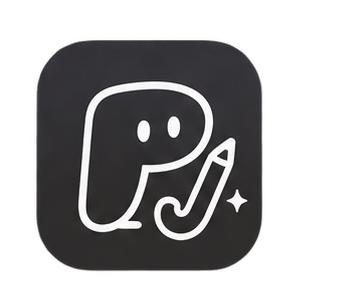</p>

<h1 align="center">proJect</h1>

<p align="center">
  <b>공부한 만큼 캐릭터가 자라는 공부 관리 웹앱</b><br>
  타이머로 기록하고 · 캐릭터를 키우고 · 스터디 친구들과 서로 자극받기
</p>

<p align="center">
  <a href="https://4e0ad04b-ff5c-4513-8410-3ad9744fa866.vip.gensparksite.com"><b>▶ 바로 써 보기</b></a>
  &nbsp;·&nbsp; <a href="#주요-기능">주요 기능</a>
  &nbsp;·&nbsp; <a href="#기술-스택과-구조">기술 스택</a>
  &nbsp;·&nbsp; <a href="#개발자용-내-pc에서-실행하기">개발자용 실행 방법</a>
  <br><sub>2026 SCNU OSS·AI 해커톤 기초트랙 출품작 · MIT License</sub>
</p>

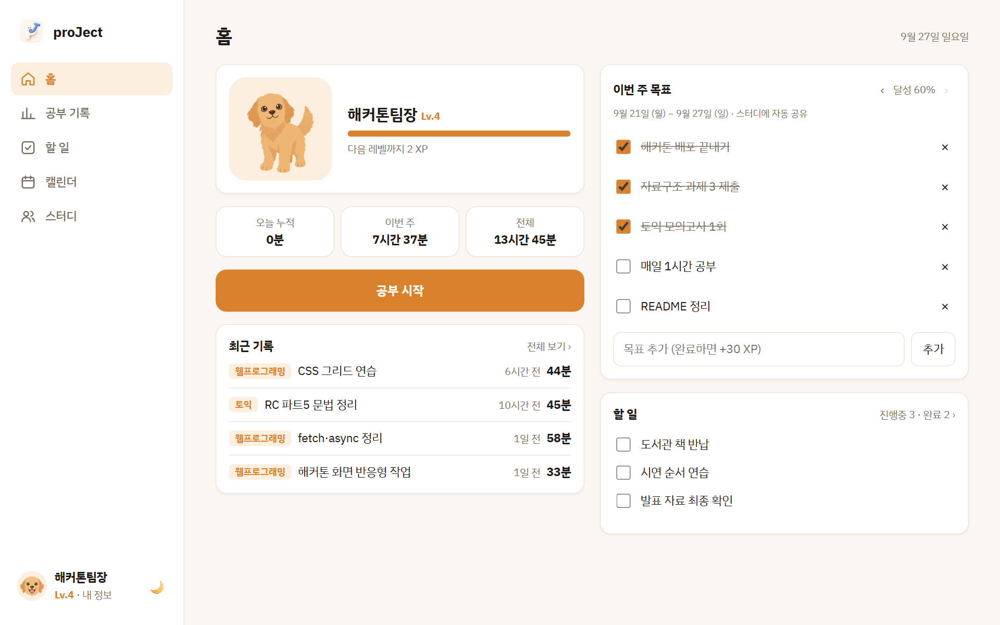

## 왜 만들었나요

혼자 하는 공부가 흐지부지되는 이유는 대개 세 가지입니다. proJect는 이 세 가지를 한 앱에서 해결합니다.

| 혼자 공부할 때의 문제 | proJect의 해결 |
|---|---|
| 😶 얼마나 했는지 모른다 | 과목을 고르고 **타이머**를 누르면 기록이 쌓이고, 과목별·주간 공부시간이 바로 보입니다 |
| 😮‍💨 꾸준히 하기 어렵다 | 공부한 시간과 끝낸 목표만큼 **경험치**를 받아 **캐릭터가 아기 → 성장 → 어른**으로 자랍니다 |
| 🫥 혼자라 지친다 | **스터디**에 들어가면 내 기록이 자동으로 공유되고, 친구 기록에 **👏 응원과 댓글**을 남깁니다 |

누구나 가입하자마자 쓸 수 있도록 **화면은 가볍게, 기능은 꼭 필요한 것만** 담았습니다.

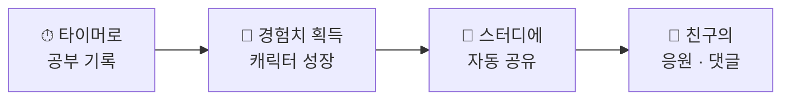

## 주요 기능

### ⏱ 공부 타이머
- **준비 → 진행 → 회고** 3단계입니다. 과목을 고르고 오늘 할 공부를 적은 뒤 시작합니다.
- 일시정지한 시간은 공부시간에서 빠지고 따로 보입니다. 1분 미만은 저장하지 않고, 한 번에 최대 8시간까지 인정합니다.
- 타이머가 **서버에서** 돌아가므로 창을 닫거나 새로고침해도, 다른 기기에서 열어도 이어집니다. 다른 화면에 있어도 메뉴와 브라우저 탭 제목에 시간이 보입니다.
- 끝나면 회고 4칸(공부한 내용 · 잘한 점 · 어려웠던 점 · 다음에 할 일)과, 원하면 공부 시작·종료 인증 사진을 남깁니다.

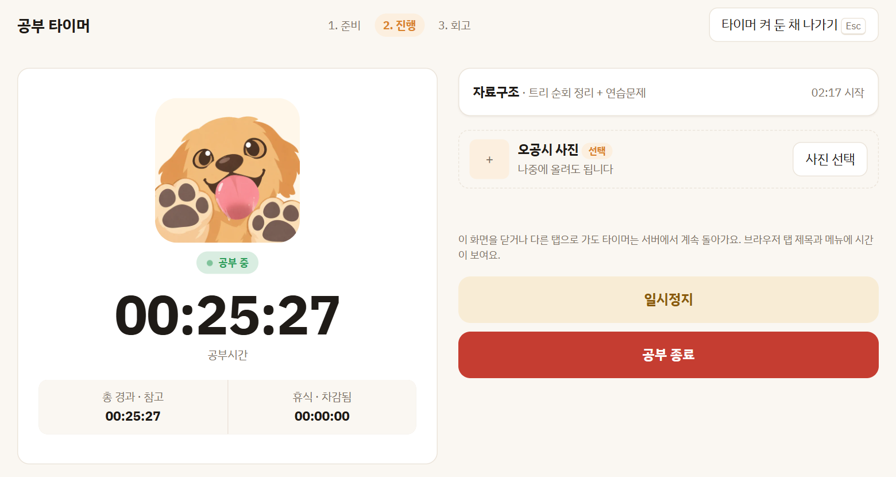

### 🐾 캐릭터 성장
가입할 때 네 캐릭터 중 하나를 고릅니다. 나중에 바꿔도 레벨은 그대로입니다.

<table>
  <tr>
    <td align="center"><br>리트리버</td>
    <td align="center"><br>삼색냥이</td>
    <td align="center"><br>검정냥이</td>
    <td align="center"><br>달마시안</td>
  </tr>
</table>

레벨이 오르면 모습이 바뀝니다. 공부를 마치고 새 모습이 열리는 순간에는 실루엣이 걷히며 새 모습이 공개됩니다.

<table>
  <tr>
    <td align="center"><br><b>아기</b><br>Lv 1 ~ 4</td>
    <td align="center"><br><b>성장</b><br>Lv 5 ~ 9</td>
    <td align="center"><br><b>어른</b><br>Lv 10 ~</td>
  </tr>
</table>

<p align="center">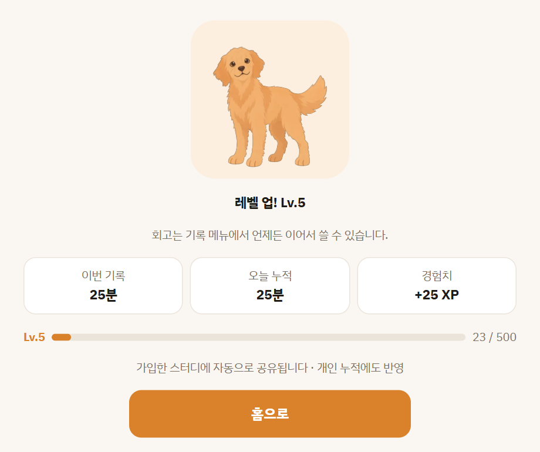<br><sub>공부를 마치고 Lv5가 되어 성장 모습이 공개된 화면</sub></p>

- **경험치:** 공부 1분 = 1 XP (기록 1건당 최대 240) · 주간 목표 1개 완료 = 30 XP (한 주 10개까지)
- **레벨:** Lv N → N+1 에 100 × N XP
- 홈에서 캐릭터가 숨 쉬고 걸어 다니고, 누르면 반응합니다. 타이머 중에는 응원하고, 일시정지하면 꾸벅꾸벅 좁니다.
- 예전 모습이 더 좋다면 **내 정보 → 표시 모습**에서 이미 열린 모습 중에 고를 수 있습니다.

### 👥 스터디
- 스터디를 만들면 **초대 코드**가 생기고, 친구는 그 코드로 들어옵니다.
- 멤버마다 **이번 주 공부시간 · 목표 달성률 · 레벨 · 지금 공부 중인지**가 한눈에 보입니다.
- 멤버들의 공부 기록이 피드로 모이고, **👏 응원**과 **댓글**을 남길 수 있습니다.
- 스터디용으로 따로 입력할 것은 없습니다. 개인 화면에서 기록하면 가입한 모든 스터디에 자동으로 보입니다.

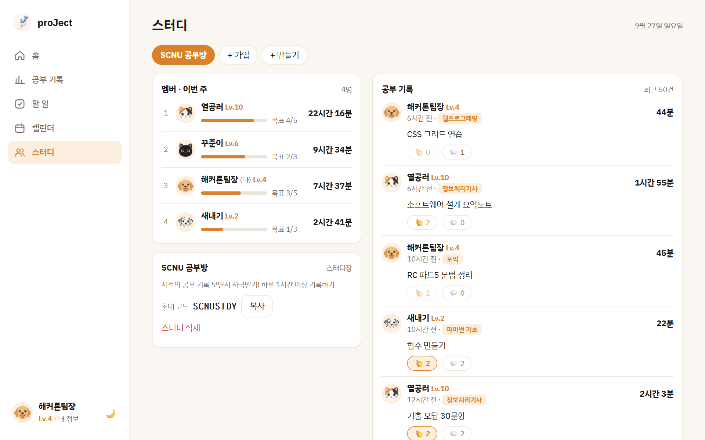

### 📊 기록 · 🎯 주간 목표 · ✅ 할 일 · 📅 캘린더
- **공부 기록:** 과목별 누적 시간, 과목별 보기, 기록마다 회고·사진 보기와 수정
- **주간 목표:** 이번 주 목표를 체크리스트로 쓰고 달성률을 봅니다. 지난 주 목표는 기록으로 남습니다.
- **할 일:** 간단한 체크리스트 (진행중 / 완료)
- **캘린더:** 월 달력에 개인 일정과 시간을 적습니다. 나만 볼 수 있습니다.

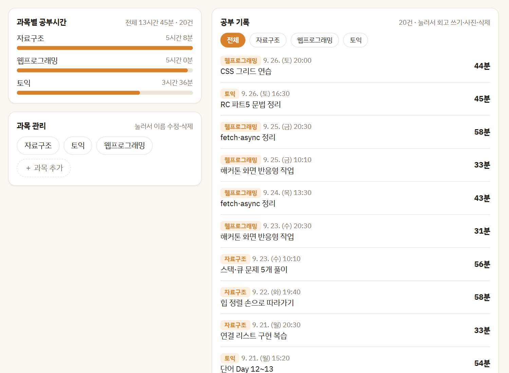

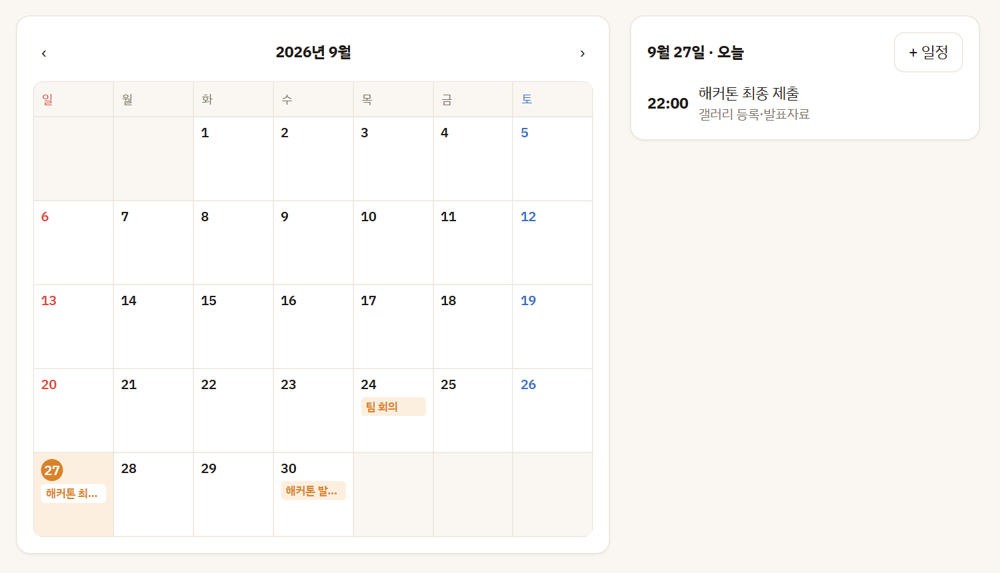

### 🔐 계정
- 아이디와 비밀번호만으로 가입합니다. 이메일 등 개인정보는 받지 않습니다.
- 가입할 때 **복구 코드**(XXXX-XXXX)를 한 번 보여 줍니다. 비밀번호를 잊으면 아이디와 복구 코드로 새 비밀번호를 정할 수 있습니다.
- 내 정보에서 비밀번호 변경과 복구 코드 새로 받기를 할 수 있습니다.

### 📱 PC · 모바일 · 다크 모드
PC 브라우저를 기준으로 만들었고, 휴대폰 브라우저에서는 한 줄 배치와 하단 탭으로 바뀝니다. 기기의 다크 모드 설정을 따르며 버튼으로도 바꿀 수 있습니다.

<table>
  <tr>
    <td align="center">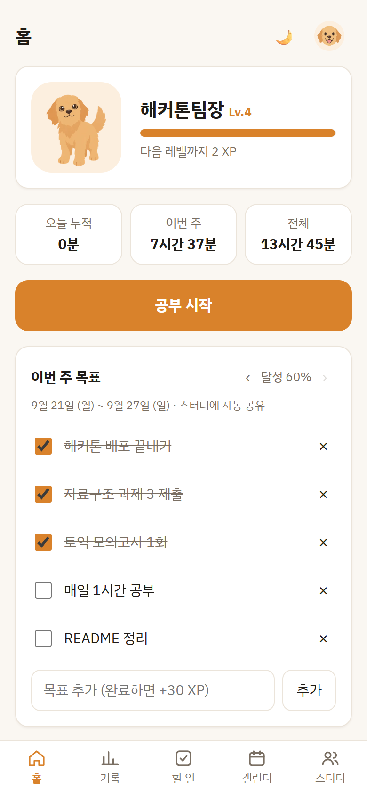<br>모바일 홈</td>
    <td align="center">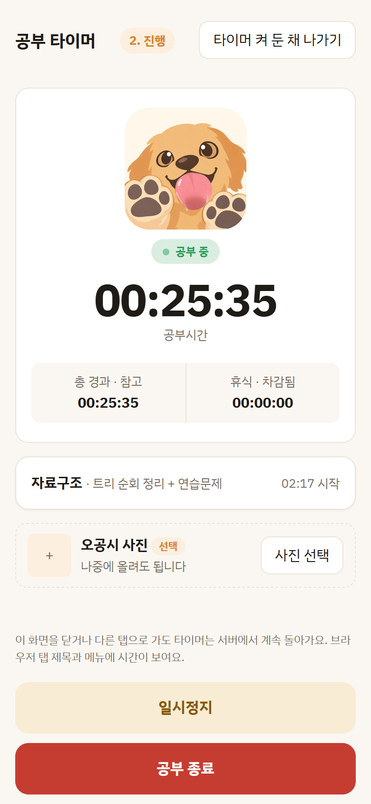<br>모바일 타이머</td>
  </tr>
</table>

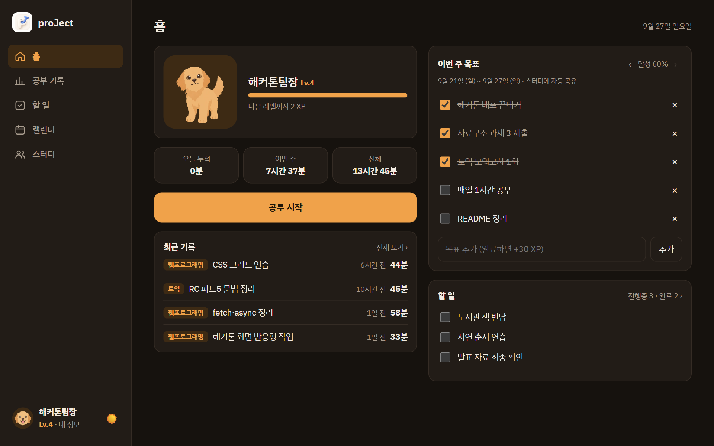

## 처음 써 보기

> **설치할 것이 없습니다.** PC나 휴대폰 브라우저(크롬·사파리·엣지 등)로 아래 링크만 열면 바로 쓸 수 있습니다.
> 👉 https://4e0ad04b-ff5c-4513-8410-3ad9744fa866.vip.gensparksite.com

1. [배포 주소](https://4e0ad04b-ff5c-4513-8410-3ad9744fa866.vip.gensparksite.com)에서 **회원가입**합니다. 캐릭터를 고르고, 가입 직후 나오는 **복구 코드를 저장**합니다.
2. 홈에서 **공부 시작** → 과목 추가·선택 → **타이머 시작**
3. 다 했으면 **공부 종료** → 회고 쓰기 → 경험치 받기
4. **스터디** 탭에서 스터디를 만들어 초대 코드를 친구에게 보내거나, 받은 코드로 들어갑니다.

## 기술 스택과 구조

| 영역 | 사용 기술 |
|---|---|
| 프론트엔드 | HTML, CSS, JavaScript (빌드 없는 ES 모듈) |
| 백엔드 | [Hono](https://hono.dev) (TypeScript) |
| 데이터베이스 | Cloudflare D1 (SQLite) |
| 사진 저장 | Cloudflare R2 |
| 배포 | Cloudflare Pages (Genspark 호스팅) |
| 빌드 · 개발 | Vite, Wrangler |

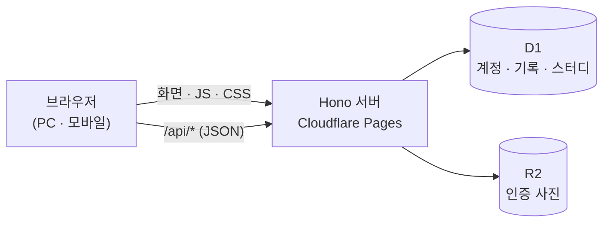

### 설계에서 신경 쓴 점
- **권한은 모두 서버에서 검사합니다.** 다른 사람의 기록·할 일·일정은 요청해도 "없음(404)"으로 응답합니다. 스터디 기록과 사진은 같은 스터디 멤버만 볼 수 있습니다.
- **비밀번호와 복구 코드는 해시(PBKDF2)로만 저장**하고, 로그인 쿠키는 HttpOnly입니다. 복구 코드를 5번 틀리면 15분 동안 잠깁니다.
- **경험치는 기록을 근거로 계산합니다.** 기록을 지우면 받은 경험치도 함께 회수되고, 같은 기록으로 두 번 받을 수 없습니다.
- **스터디 피드는 복사본 없이 원본 기록을 조회합니다.** 여러 스터디에 가입해도 개인 누적이 중복되지 않습니다.
- **수치는 한 파일에서 조정합니다.** 경험치·레벨·시간 제한은 [`src/lib/rules.ts`](src/lib/rules.ts)에 모여 있습니다.

## 개발자용: 내 PC에서 실행하기

> 앱을 **쓰는 데는 이 과정이 필요 없습니다.** 코드를 고치거나 내 PC에서 개발용으로 띄워 보려는 개발자를 위한 안내입니다.

Node.js 20 이상이 필요합니다.

```bash
npm install               # 최초 1회
npm run db:migrate:local  # 로컬 DB 만들기 (최초 1회)
npm run dev               # 개발 서버 → http://localhost:5173
```

| 명령 | 하는 일 |
|---|---|
| `npm run build` | 배포용 빌드 → `dist/` |
| `npm run typecheck` | 타입 검사 |
| `npm run check:api` | 서버 API 자동 점검 82항목 (개발 서버를 켠 상태에서) |
| `npm run demo:reset:local` | 시연 계정 test1~4를 초기 데이터로 되돌리기 ([시연 데이터](docs/시연데이터.md)) |

`check:api`는 계정 여러 개를 만들어 가입, 타이머, 기록, 목표, 스터디, 사진, 비밀번호 찾기, 그리고 **남의 자료에 접근할 수 없는지**까지 확인합니다.

## 폴더 구조

```
├── src/                   # 서버 (Hono)
│   ├── index.tsx          #   진입점: 페이지와 /api 연결
│   ├── routes/            #   API: auth, timer, records, goals, studies, todos, events, subjects, photos
│   └── lib/               #   로그인, 경험치 규칙(rules.ts), 날짜 등 공통 코드
├── migrations/            # DB 스키마 (Cloudflare D1)
├── public/static/         # 브라우저 코드
│   ├── js/views/          #   화면: 홈, 타이머, 기록, 할 일, 캘린더, 스터디, 내 정보
│   ├── img/characters/    #   캐릭터 그림 (4종 × 동작 · 성장 단계)
│   └── style.css
├── scripts/               # API 점검, 캐릭터 그림 변환, 시연 데이터
├── docs/                  # 기획 · 설계 문서
└── assets/screenshots/    # README 스크린샷
```

## 개발 과정

**기획 → 화면 목업 → 구현 → 배포** 순서로 진행했고, 단계마다 문서를 먼저 정리한 뒤 만들었습니다.

1. **기획:** 팀 회의로 기능 범위와 공개 범위(무엇을 누구에게 보여 줄지)를 정했습니다. → [기획서](docs/기획서.md)
2. **설계:** 기능 명세, 데이터 모델, API를 문서로 만들었습니다. → [기능명세](docs/기능명세.md) · [데이터 모델](docs/데이터모델.md) · [API](docs/API.md)
3. **구현:** 팀원이 만든 캐릭터·로고와 타이머·할 일 화면 구성을 반영했습니다. 여러 계정으로 권한을 검증하는 자동 점검을 함께 만들었습니다.
4. **배포:** Genspark 호스팅(Cloudflare Pages + D1 + R2)에 올리고, 배포본 파일이 저장소와 같은지 확인했습니다.

**AI 도구 활용:** 앱 안에는 AI 기능을 넣지 않고, 만드는 과정에 AI 도구를 활용했습니다.

| 도구 | 한 일 |
|---|---|
| GPT 이미지 생성 | 캐릭터 원화 이미지 생성 |
| Claude 디자인 | 원화와 같은 그림체로 걷기·타이머·성장 단계 등 추가 동작 제작 |
| Claude Code | 서버·화면 코드, 설계 문서, 자동 점검 작성과 버그 수정 |
| Genspark | 배포·호스팅 (Cloudflare Pages + D1 + R2) |

## 팀

| 역할 | 맡은 일 |
|---|---|
| 팀장 | 기획 총괄, 서버·DB·로그인, 캘린더·스터디 화면, 배포 |
| 팀원 1 | 캐릭터 디자인, 로고 |
| 팀원 2 | 타이머·할 일 화면 구성 |

## 문서

- [기획서](docs/기획서.md) · [기능명세](docs/기능명세.md) · [데이터 모델](docs/데이터모델.md) · [서버 API](docs/API.md)
- [기술 스택 결정](docs/기술스택.md) · [대회 정보](docs/대회정보.md) · [시연 데이터](docs/시연데이터.md)
- [팀 공유 — 프로젝트 진행 정리](docs/팀공유_프로젝트_진행정리.md)
- [변경 기록 (버전별)](CHANGELOG.md) · [릴리스](https://github.com/xogns7299-afk/proJect/releases)

## 라이선스와 사용한 오픈소스

- 이 프로젝트: [MIT](LICENSE)
- [Hono](https://github.com/honojs/hono) (MIT) · [Vite](https://github.com/vitejs/vite) (MIT) · [Wrangler](https://github.com/cloudflare/workers-sdk) (MIT/Apache-2.0)
- 글꼴: [IBM Plex Sans KR](https://github.com/IBM/plex) (SIL Open Font License 1.1)
